## Farmer_Markus
I love open source software and my goal is to rewrite Nintendo's Legend of Zelda Spirit Tracks in c++ and use the original 3d models/textures and music.

Games worth playing: [Return to the Roots](https://github.com/Return-To-The-Roots/s25client), [Mindustry](https://github.com/Anuken/Mindustry), [0a.d.](https://github.com/0ad/0ad),  [Minecraft](https://www.minecraft.net/), [Satisfactory](https://www.satisfactorygame.com/), [Warzone 2100](https://wz2100.net/), [Factorio](https://www.factorio.com/), [Raft](https://www.raft-game.com/), [Anno 1404](https://de.wikipedia.org/wiki/Anno_1404)

## To every gamestudio
OPTIMIZE YOUR GAMES!  
Nobody should need an nvidia rtx 3060 to play a modern 2d game!  
Even 3d games should be able to run on lower hardware with lower graphic settings

### Additional
Check out my [Android port](https://github.com/Farmer-Markus/s25rttr-android) of [Settlers 2](https://en.wikipedia.org/wiki/The_Settlers_II) [Return to the Roots](https://siedler25.de)  
Feel free to [mail](mailto:mail@farmermarkus.de) me any questions or suggestions :D

